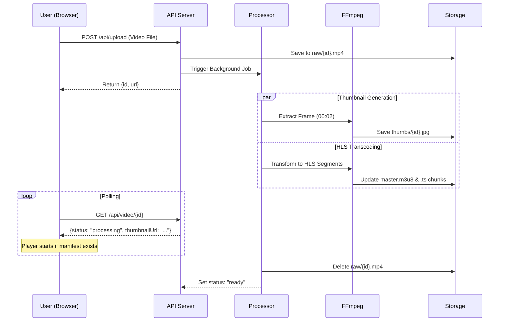

# Architecture Document: Private Video Streaming Service

## 1. Overview

This document describes the architecture of a minimal private video streaming service optimized for **time-to-stream** (fast availability after upload) rather than high video quality.

## 2. Core Requirements & Scorecard

| Requirement | Implementation Status | Note |
| :--- | :--- | :--- |
| **Anonymous Upload** | ✅ Implemented | No authentication required. |
| **1GB File Limit** | ✅ Implemented | Enforced via `http.MaxBytesReader` and frontend validation. |
| **Common Formats** | ✅ Implemented | Supports MP4, MOV, MKV, WebM via FFmpeg. |
| **Shareable Link** | ✅ Implemented | UUID-based links generated per upload. |
| **Browser Streaming** | ✅ Implemented | HLS.js integration for cross-browser support. |
| **Time-to-Stream** | ✅ Optimized | HLS allows playback before transcoding finishes. |
| **Tech Stack** | ⚠️ Deviation | Used Go/React instead of preferred Rust/Svelte. |

## 3. Architecture Decisions

### 3.1 Streaming Format: HLS (HTTP Live Streaming)

**Decision**: Use HLS instead of progressive download or DASH.

**Rationale**:
- **Time-to-Stream**: HLS segments enable "play while processing". Once the first 4-second segment and the manifest are written, the user can start watching.
- **Consistency**: Segment-based delivery ensures consistent buffering and playback regardless of the original file size (addressing Bonus #1).
- **Compatibility**: Native support on iOS/macOS; industry-standard `HLS.js` provides support for other browsers.
- **Simplicity**: Served as static files via standard HTTP; no specialized RTSP/RTMP servers needed.

### 3.2 Media Processing Pipeline

**Decision**: Asynchronous FFmpeg processing with a semaphore-controlled worker pool.

- **FFmpeg**: The industry standard for reliability and format support.
- **Concurrency Control**: A Go channel-based semaphore limits concurrent transcoding jobs (default: 2) to prevent CPU starvation.
- **Thumbnail Generation**: A thumbnail is extracted from the 2-second mark of the video concurrently with the HLS conversion. The system also performs "self-healing" on startup: if it finds processed videos without thumbnails, it automatically generates them.
- **Fast Encoding**: Using `libx264` with the `fast` preset prioritizes throughput and low latency, essential for the "time-to-stream" requirement.
- **Play While Processing**: FFmpeg writes the HLS manifest and segments in real-time. The frontend detects when the manifest (`master.m3u8`) is created and starts playback even while following segments are still being generated.

### 3.3 Storage & Lifecycle Strategy

**Decision**: Local filesystem with separate lifecycle stages to optimize performance and cost.

```text
storage/
  ├── raw/       # Temporary storage for uploaded files (deleted after HLS conversion)
  ├── hls/{id}/  # Persistent HLS manifest (.m3u8) and segments (.ts)
  └── thumbs/    # Persistent JPG thumbnails for the library view
```

**Rationale**:
- **Cost Efficiency**: Deleting the raw source files (up to 1GB) after conversion significantly reduces long-term storage requirements.
- **Consistency**: Segment-based delivery ensures consistent buffering regardless of the original file size.

### 3.4 API Design & Frontend Interaction

- **`POST /api/upload`**: Validates size and extension, saves to `raw/`, and triggers background processing.
- **`GET /api/video/{id}`**: Returns status (`processing`, `ready`, `error`), `streamUrl`, and `thumbnailUrl` (once generated).
- **`GET /api/videos`**: Lists all videos with their metadata, status, and `thumbnailUrl` for the library gallery.
- **`GET /thumbnails/{id}.jpg`**: Serves the generated preview image.

### 3.5 System Interaction Flow



## 4. Processing Flow

1. **Upload Phase**: File is streamed to `raw/{id}.mp4`.
2. **Initialization**: API returns success; `processor` creates an in-memory record.
3. **Thumbnail Extraction**: FFmpeg extracts a frame at `00:00:02`.
4. **HLS Conversion**: FFmpeg starts generating `.ts` segments and updating `master.m3u8`.
5. **Streaming**: Frontend starts playing as soon as `master.m3u8` is accessible.
6. **Cleanup**: Once FFmpeg finishes, the original file in `raw/` is deleted.

## 5. Configuration

System behavior is managed via `config.yaml`:
- **Server**: Binding address and port.
- **Storage**: Directory paths for each file type.
- **Upload**: Max file size (default 1GB) and allowed extensions.
- **FFmpeg**: Segment duration (default 4s) and codecs.

## 6. Scalability & Production Roadmap (Bonus #2)

The current implementation is a **Single-Node Architecture**. To scale horizontally, the following transitions are designed:

### 5.1 Distributed Worker Pattern
Currently, transcoding happens on the web server. In production:
- **Task Queue**: Move tasks to Redis or RabbitMQ.
- **Worker Nodes**: Dedicated "Transcoder" instances consume tasks from the queue. This allows the API to remain responsive while heavy lifting is offloaded.

### 5.2 Shared Storage
Currently, files are local. In production:
- **Object Storage**: Use S3 or GCS for the final HLS segments.
- **NFS/EFS**: Use a shared mount for the "raw" staging area so any worker can access the uploaded file.

### 5.3 Persistent Metadata
Currently, metadata is in-memory. In production:
- **Database**: Move video records to PostgreSQL or MongoDB to ensure state is preserved across restarts and shared between multiple API instances.

### 5.4 Delivery Optimization (Cost Efficiency)
- **CDN**: Place CloudFront or Cloudflare in front of the `/streams` path to cache segments geographically closer to users, reducing egress costs and server load.

## 6. Security Considerations

- **Anonymity**: No user data is collected. Privacy is maintained by the UUID-based link being the only way to discover the video.
- **Upload Safety**: Input file sizing is strictly enforced at the middleware level to prevent DOS attacks.
- **FFmpeg Sandboxing**: In a production environment, FFmpeg should run in a restricted container (e.g., Docker with limited resources) to prevent potential exploit-based attacks via malicious video headers.
